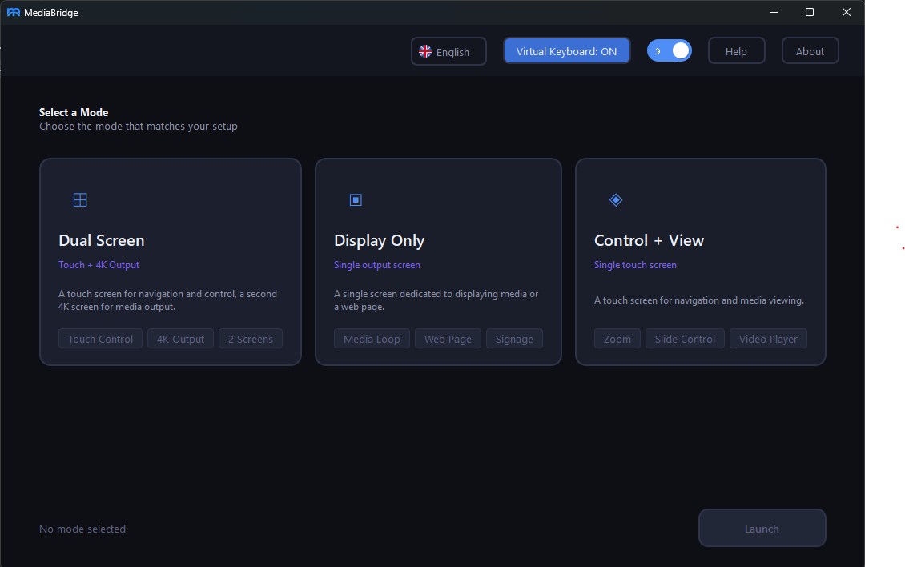

# MediaBridge

A professional multi-screen kiosk platform for presentations, digital signage, and interactive media. Built with **PySide6**

**Supports:** PDF · Images · Video · Web Pages · Live Streams (YouTube, Vimeo)

---

## Version History

| Version | Date       | Notes                  | Download |
|---------|------------|------------------------|----------|
| 1.0.0   | 2026-05-29 | Initial release (all modes not complete)      |[Download MediaBridge v1.0.0](./my-folder.zip)|

---


## Display Modes

### Dual Screen
Two physical screens: a **touch control** screen for browsing/selecting content, and a **4K display** screen for media output. Connected via `MediaBus` event bus.

### Display Only
Single fullscreen window showing one content type (URL, images, PDF, video, or stream). Supports input blocking, exit hotkey, exit badge, and system tray controls.

### Control + View
Single touch screen for both navigation and media viewing. *(Configuration UI built, runtime pending)*

---

## 1. Clone & set up virtual environment

```bash
git clone <repo-url> mediabridge
cd mediabridge

# Windows
python -m venv .venv
.venv\Scripts\activate

# Linux
python3 -m venv .venv
source .venv/bin/activate
```

## 2. Install dependencies

```bash
pip install -r requirements.txt
```

## 3. Run in development

```bash
python main.py
```

---



## 4. Build executable

### Windows

```powershell
pyinstaller --noconfirm --onedir --windowed `
  --name "MediaBridge" `
  --add-data "core/locales;core/locales" `
  --add-data "core/languages.json;core" `
  --add-data "core/modes.json;core" `
  --add-data "ui/assets;ui/assets" `
  --add-data "ui/themes/qss;ui/themes/qss" `
  --hidden-import "PySide6.QtMultimedia" `
  --hidden-import "PySide6.QtMultimediaWidgets" `
  --hidden-import "PySide6.QtPdf" `
  --hidden-import "PySide6.QtPdfWidgets" `
  --hidden-import "PySide6.QtWebEngineWidgets" `
  --hidden-import "PySide6.QtWebEngineCore" `
  --hidden-import "PySide6.QtNetwork" `
  --icon "ui/assets/images/mblogo.ico" `
  main.py
```

Output: `dist/MediaBridge/MediaBridge.exe`

### Linux

```bash
pyinstaller --noconfirm --onedir --windowed \
  --name "MediaBridge" \
  --add-data "core/locales:core/locales" \
  --add-data "core/languages.json:core" \
  --add-data "core/modes.json:core" \
  --add-data "ui/assets:ui/assets" \
  --add-data "ui/themes/qss:ui/themes/qss" \
  --hidden-import "PySide6.QtMultimedia" \
  --hidden-import "PySide6.QtMultimediaWidgets" \
  --hidden-import "PySide6.QtPdf" \
  --hidden-import "PySide6.QtPdfWidgets" \
  --hidden-import "PySide6.QtWebEngineWidgets" \
  --hidden-import "PySide6.QtWebEngineCore" \
  --hidden-import "PySide6.QtNetwork" \
  main.py
```

Output: `dist/MediaBridge/MediaBridge`

## License

MIT


